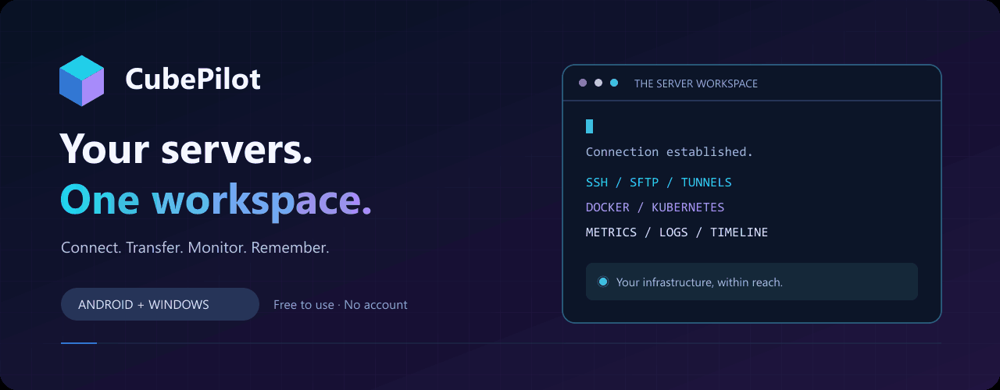
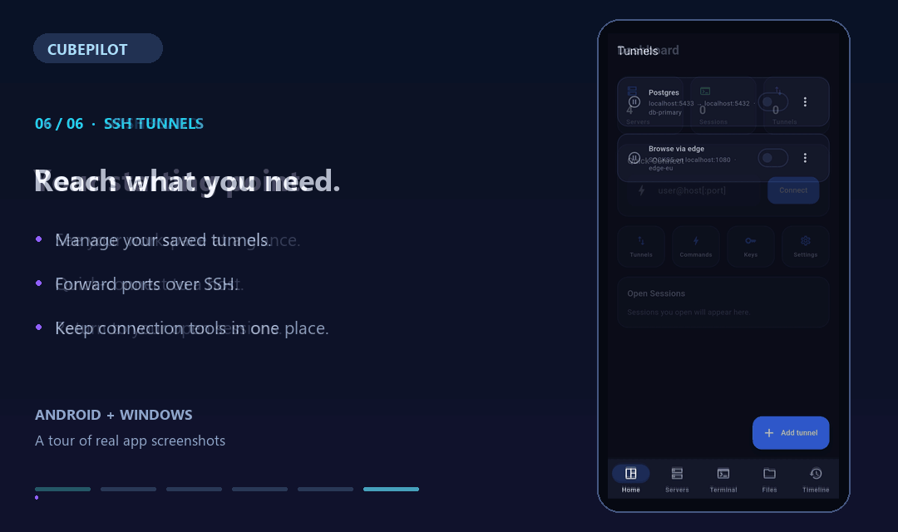

[بنر ثابت](assets/hero.svg)

تور ۱۸ ثانیه‌ای از تصاویر واقعی برنامه؛ ظاهر نسخهٔ جدید ممکن است متفاوت باشد. [دربارهٔ دمو](docs/demo.md) · [پیش‌نمایش ثابت](assets/app-demo-preview.png)

**ترمینال، فایل‌ها، کانتینرها و سلامت سرور؛ روی اندروید و ویندوز.**

**[دانلود](#دانلود)** · [قابلیت‌ها](#ابزارهای-روزمره-مدیریت-سرور) · [English](README.md)

## دانلود

**[نسخهٔ ۰٫۵٫۰ منتشر شد](https://github.com/cubepy/CubePilot/releases/tag/v0.5.0)**؛ انتقال قابل ادامه، نشست tmux، کلیدهای قابل تنظیم، سینی سیستم ویندوز، بررسی نسخهٔ جدید و مقایسهٔ سلامت سرور.

| اندروید | ویندوز |
| :--- | :--- |
| **[دانلود APK برای ARM64](https://github.com/cubepy/CubePilot/releases/download/v0.5.0/CubePilot_v0.5.0_arm64_v8a.apk)** | **[دانلود ZIP برای ویندوز x64](https://github.com/cubepy/CubePilot/releases/download/v0.5.0/CubePilot_v0.5.0_windows_x64.zip)** |
| مناسب بیشتر گوشی‌های امروزی؛ اندروید ۸ به بالا | فایل را استخراج و `cubepilot.exe` را اجرا کنید |
| [ARM سی‌ودو بیتی](https://github.com/cubepy/CubePilot/releases/download/v0.5.0/CubePilot_v0.5.0_armeabi_v7a.apk) · [x86_64](https://github.com/cubepy/CubePilot/releases/download/v0.5.0/CubePilot_v0.5.0_x86_64.apk) | ویندوز ۱۰ نسخهٔ 1809 به بالا، ۶۴ بیتی |

[راهنمای نصب](docs/installation.md) · [توضیحات نسخه و SHA-256](https://github.com/cubepy/CubePilot/releases/tag/v0.5.0) · [همهٔ نسخه‌ها](https://github.com/cubepy/CubePilot/releases)

## ابزارهای روزمره مدیریت سرور

CubePilot کارهای اطراف یک اتصال SSH را در یک فضای کاری جمع می‌کند: اتصال به سرور، جابه‌جایی فایل، مدیریت کانتینر، دنبال‌کردن لاگ و مرور فعالیت‌ها. استفادهٔ شخصی و تجاری رایگان است و به حساب کاربری یا اشتراک نیاز ندارد.

| اتصال و کار | بررسی و مدیریت | حفظ سابقه |
| :--- | :--- | :--- |
| چند نشست SSH و ترمینال تقسیم‌شده | مدیریت Docker، لاگ و شل کانتینر | تایم‌لاین فعالیت هر سرور |
| کلید SSH، جامپ‌هاست و پراکسی | عملیات و منابع Kubernetes | یادداشت، جست‌وجو و نشانک |
| مرور فایل و انتقال SFTP | نمودار پردازنده، حافظه، دیسک و شبکه | دستورها و قطعه‌کدهای ذخیره‌شده |
| تونل محلی، راه دور و SOCKS5 | لاگ زنده و بررسی سلامت سرور | پوشه، برچسب و گروه هوشمند |

### ادامهٔ کار پس از قطع اتصال

- **کنترل انتقال فایل:** آپلود و دانلود را متوقف موقت، ادامه یا لغو کنید. پس از قطع ارتباط، دوباره وصل شوید و انتقال را ادامه دهید. صف انتقال فقط در اجرای فعلی برنامه نگه داشته می‌شود.
- **شل ماندگار با tmux:** این گزینه را برای سرور ذخیره‌شده فعال کنید تا پس از قطع اتصال یا بازکردن دوبارهٔ برنامه به همان محیط برگردید. سرور باید tmux داشته باشد؛ در غیر این صورت شل معمولی باز می‌شود.
- **مقایسهٔ سلامت:** نتیجهٔ بررسی جدید با اجرای قبلی مقایسه می‌شود و آخرین وضعیت پس از بستن برنامه نیز باقی می‌ماند.

### امکانات مخصوص هر دستگاه

| اندروید | ویندوز |
| :--- | :--- |
| ردیف کلیدهای قابل تنظیم ترمینال | کنترل برنامه از سینی سیستم |
| اعلان نشست و دسترسی از تنظیمات سریع | آوردن ترمینال با `Ctrl+Alt+T` |
| ترمینال تصویر در تصویر | اجرای قابل حمل از ZIP |
| فارسی و انگلیسی، با پشتیبانی راست‌به‌چپ | فارسی و انگلیسی، با پشتیبانی راست‌به‌چپ |

در هر دو پلتفرم اعلان انتشار و بررسی دستی به‌روزرسانی وجود دارد. انتخاب کلیدها، ترتیب و ارتفاع ردیف ترمینال از تنظیمات انجام می‌شود.

## نگاهی به برنامه

<table>
<tr><td width="33%"> Dashboard</td><td width="33%"> Servers</td><td width="33%"> Terminal</td></tr>
<tr><td width="33%"> Timeline</td><td width="33%"> SFTP files</td><td width="33%"> Tunnels</td></tr>
</table>

Existing app screenshots; appearance may differ in v0.5.0. Demo data and redacted sessions: [how these were captured](docs/screenshots.md).

## هر سرور، سابقهٔ خودش

تایم‌لاین سرور، نشست‌ها و فعالیت‌های ثبت‌شده را کنار همان سرور نگه می‌دارد. یادداشت اضافه کنید، رویدادها را جست‌وجو کنید و زمینهٔ کار قبلی را دوباره ببینید. نمودارهای زنده و مقایسهٔ سلامت، بررسی مشکل را کامل‌تر می‌کنند.

## داده‌های محلی و خزانهٔ رمزگذاری‌شده

اطلاعات اتصال و تنظیمات در خزانهٔ محلی **AES-256-GCM** نگه‌داری می‌شوند و کلید اصلی با فضای امن پلتفرم محافظت می‌شود. بررسی کلید میزبان، قفل PIN، بازکردن با زیست‌سنجی در دستگاه‌های پشتیبانی‌شده و پشتیبان رمزگذاری‌شده، ابزارهای محافظت از فضای کاری هستند.

عملیات Docker و Kubernetes از اتصال SSH و ابزارها و مجوزهای موجود روی سرور استفاده می‌کنند. بررسی به‌روزرسانی به GitHub وصل می‌شود؛ نصب نسخهٔ جدید با انتخاب خود شماست.

برنامه **رایگان و متن‌بسته** است. این ریپوی عمومی فقط مستندات، تصاویر و فایل‌های انتشار را میزبانی می‌کند. [مجوز](LICENSE) · [گزارش امنیتی](SECURITY.md)

## شروع در سه قدم

1. نسخهٔ دستگاه خود را دانلود کنید و [راهنمای نصب](docs/installation.md) را بخوانید.
2. سرور را با آدرس، نام کاربری و کلید SSH یا رمز عبور اضافه و اثر انگشت کلید میزبان را بررسی کنید.
3. ترمینال، فایل‌ها یا ابزارهای بررسی سرور را از فضای کاری باز کنید.

## مشارکت و پشتیبانی

[گزارش باگ](https://github.com/cubepy/CubePilot/issues/new/choose) · [پیشنهاد قابلیت](https://github.com/cubepy/CubePilot/issues/new/choose) · [گفت‌وگو](https://github.com/cubepy/CubePilot/discussions) · [رفع اشکال](docs/troubleshooting.md) · [تغییرات](CHANGELOG.md) · [نقشهٔ راه](docs/roadmap.md)

در گزارش‌ها نسخه، سیستم‌عامل و مراحل تکرار مشکل را بنویسید؛ اطلاعات ورود و آدرس‌های خصوصی را با نمونه جایگزین کنید.

حمایت مالی اختیاری است: [حمایت ریالی از دونوفا](https://donofa.com/Cube/) · [حمایت با رمزارز](https://nowpayments.io/donation?api_key=8f7c86ca-bc8e-4f2f-bf8a-6e8397c836ab). ستاره‌دادن و گزارش دقیق باگ هم به پروژه کمک می‌کند.

---

**CubePilot** · عضوی از اکوسیستم Cube · [cubesystem.top](https://cubesystem.top)

