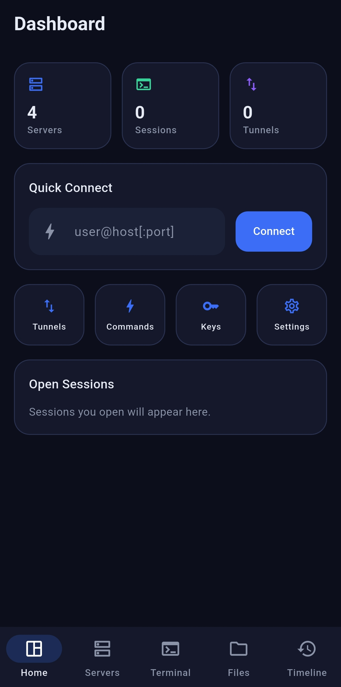
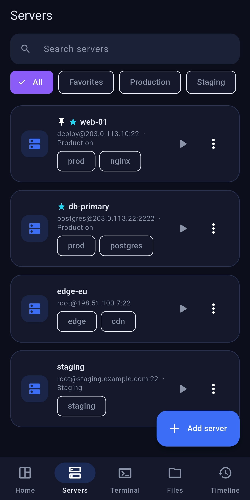
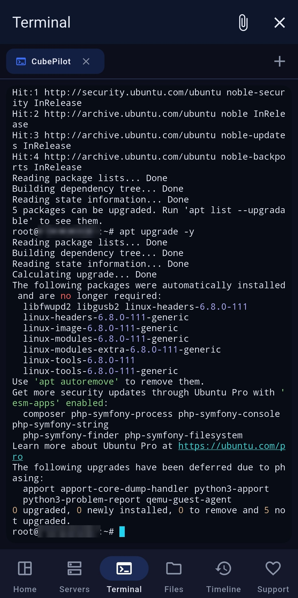
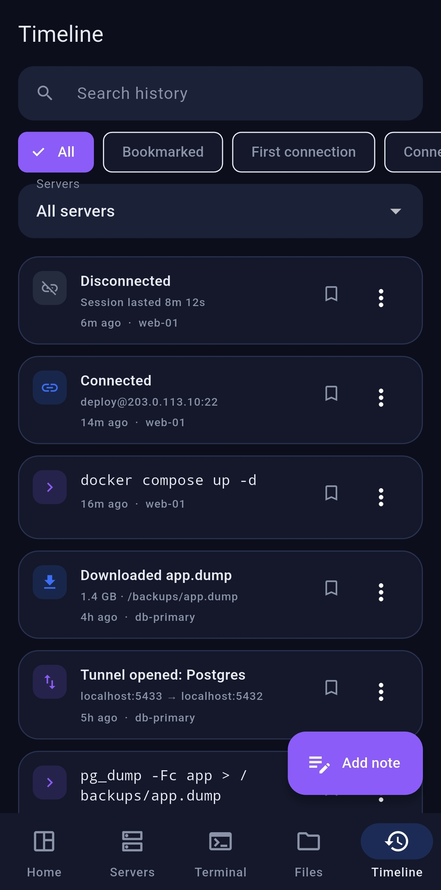
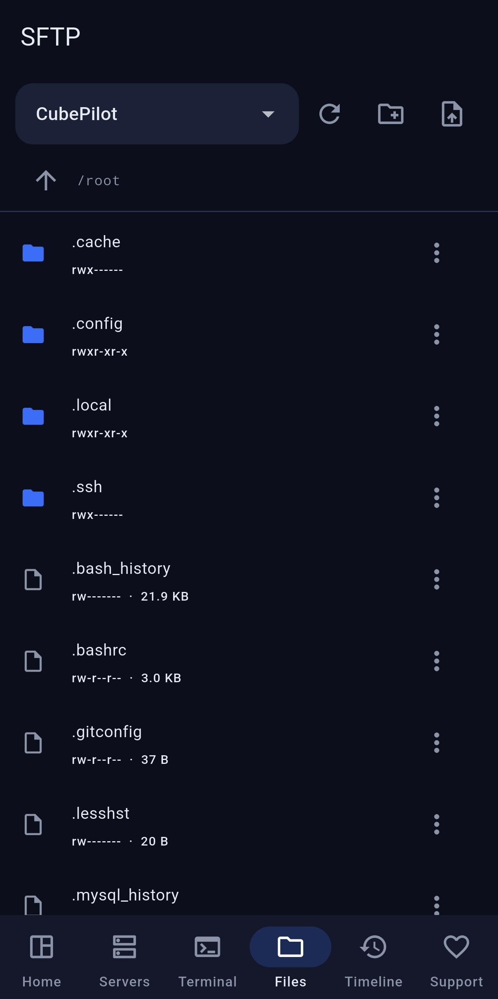
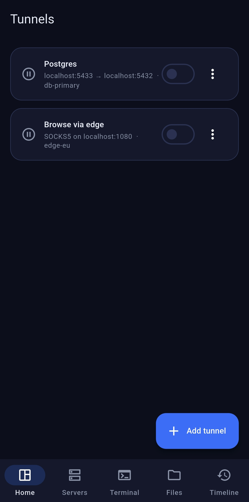
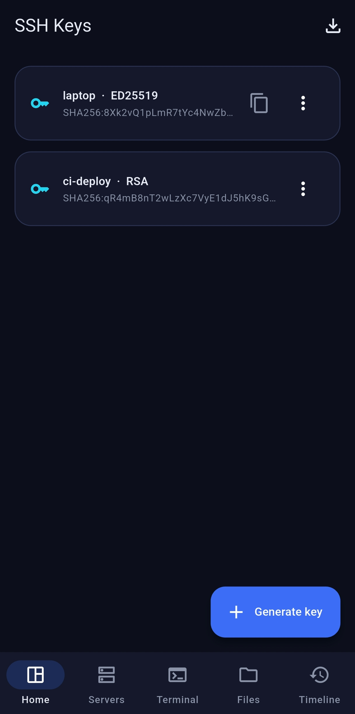
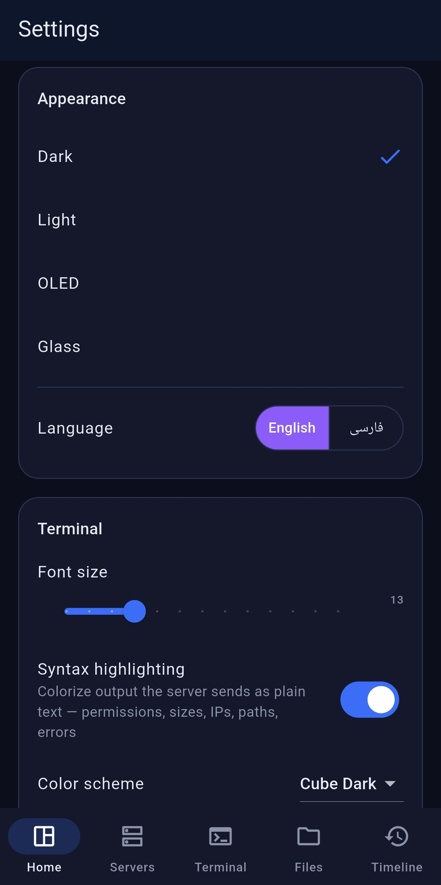

### Free. Professional. Cross Platform.

A modern workspace for managing all of your servers — SSH, SFTP, Docker, Kubernetes, tunnels and monitoring in one app, for **Android** and **Windows**.

**[فارسی](README-fa.md)** · [Download](#-download) · [Features](#-features) · [Roadmap](docs/roadmap.md) · [FAQ](docs/faq.md) · [Discussions](https://github.com/cubepy/CubePilot/discussions)

---

> **v0.1.8 is out** — Kubernetes, for Android and Windows. Grab it from [Releases](https://github.com/cubepy/CubePilot/releases/latest). Still a beta: stable enough for daily use, but not yet widely tested. Watch 👁 or Star ⭐ the repo to hear about the next one.

---

## 🧊 What is CubePilot?

Most SSH clients hand you a terminal and stop there. CubePilot is built around a different idea: your servers deserve a **workspace**, not a connection dialog.

Open the app and you land on a dashboard — how many servers you have, which are online, what you touched last, which tunnels are live. From there you're one keystroke away from a terminal, a file transfer, a container restart, or the full history of everything that has ever happened on a machine.

CubePilot is **completely free**, with no accounts, no subscriptions, no telemetry and no paywalled features. It is **closed source**, so this repository contains documentation and releases only — never source code.

## 🕒 Server Timeline — the signature feature

This is the part no other SSH client gets right.

Every server in CubePilot keeps a **complete, searchable timeline of its own history**:

- First connection and last connection
- Every session, with its duration
- Commands you ran
- Files uploaded and downloaded over SFTP
- Permission changes
- Services and Docker containers you restarted
- Tunnels created and torn down
- Important errors and status changes
- Your own notes, pinned to the moment you wrote them

Search it, filter it, tag it, bookmark it. Three weeks later, when something breaks, you no longer have to remember what you did — you scroll back and read it.

## ✨ Features

This README describes where CubePilot is going. Sections carry the version
they shipped in — everything tagged is in the build you can download today;
the rest is on the [roadmap](docs/roadmap.md).

<b>Terminal</b> — <code>v0.1.0</code>

Multi-tab sessions in one window · split view, two servers side by side or
stacked · session manager · automatic reconnection that keeps your scrollback ·
256-colour support · client-side syntax highlighting that colours plain server
output · search a session's output · copy, paste and text selection · a key bar
carrying Esc, Tab, Ctrl, Alt and the arrows · command palette on `Ctrl+K` ·
professional colour schemes · font size selection

Planned: bookmarks · paste history

<b>Server management</b> — <code>v0.1.0</code>

Folders · favorites · pinning · search · tags · per-server HTTP and SOCKS5
proxy, for hosts you cannot reach directly

Planned: live server cards showing OS, country, ping, CPU, RAM, disk and
uptime · workspaces · smart groups

<b>SFTP file manager</b> — <code>v0.1.0</code>

Browse · upload · download · rename · delete · permission editor

Planned: dual-pane layout · drag &amp; drop · in-place editing · file
preview · folder size calculation · search

<b>Port forwarding</b> — <code>v0.1.0</code>

Local forward · remote forward · dynamic SOCKS5 · saved and managed tunnels

<b>Command library &amp; snippets</b> — <code>v0.1.0</code>

Save the commands you actually use — restart Nginx, restart Docker, update the
system, run a backup, git pull, deploy — and fire them with one tap. Ships with
26 ready-made snippets for Linux, Nginx, Docker, Git, Kubernetes and SSH.

<b>SSH key manager</b> — <code>v0.1.0</code>

RSA, ED25519 and ECDSA · import and generate · fingerprint display · passphrase
support · keys held in the platform's secure storage

<b>Security</b> — <code>v0.1.0</code>

Fingerprint unlock · PIN · auto-lock · AES-256-GCM encrypted vault with the
master key in the platform keystore · host key verification

Planned: Windows Hello

<b>Backup, no account required</b> — <code>v0.1.0</code>

Export and import an encrypted backup file. Your data stays yours — there is no
CubePilot cloud, and nothing is uploaded anywhere.

<b>Docker</b> — <code>v0.1.4</code>

A server's containers, running and stopped · start, stop and restart · logs ·
shell into a container · delete. Over the SSH connection you already have, so
there is nothing to install and no second credential to store.

Planned: images · networks · volumes · resource stats

<b>Kubernetes</b> — <code>v0.1.8</code>

Pods, deployments, services, ConfigMaps and Secrets · one namespace or all of
them · pod logs and a shell inside a pod · rollout restart and scaling. Run
through the server you are connected to, using the kubeconfig it already has,
so no cluster credential goes on your phone.

Secrets are listed by name and type only — CubePilot never reads their
contents.

<b>Log viewer</b> — <code>v0.1.7</code>

The systemd journal, the usual files under `/var/log`, `dmesg`, or any path you
type · read the tail or follow it live · lines coloured by severity · filter
literally or with a regular expression · bookmarks · export what is on screen

<b>Monitoring</b> — <code>v0.1.5</code>

Live CPU, RAM and disk on the dashboard, with load average, uptime, hostname
and distribution, read over the connection you already have.

Planned: network · temperature · bandwidth · ping · charts

### Platform-native touches

Only the session notification has shipped so far; the rest is the v1.0.0
milestone.

| Android | Windows |
| --- | --- |
| Session notification — `v0.1.0` | Fluent Design |
| Material You with dynamic color | Mica and Acrylic surfaces |
| Home-screen widget | Tray icon |
| Quick Settings tile | Global shortcut |
| Floating terminal | Multi-window |
| Split-screen support | Multi-monitor support |

## 🎨 Design

Dark, Light, OLED and Glass themes built on a blue → purple palette with a cyan accent. Glassmorphism, acrylic blur, floating cards, soft shadows, and animations that stay smooth at 120 Hz on displays that support it.

## 📥 Download

All builds are published through **[GitHub Releases](https://github.com/cubepy/CubePilot/releases)** — that is the only official distribution channel.

| Platform | File | Requirement |
| --- | --- | --- |
| Android | `.apk` | Android 8.0 (API 26) or newer |
| Windows | `.zip` (portable) | Windows 10 1809 or newer, 64-bit |

Step-by-step instructions, including how to install an APK outside the Play Store and how to handle the SmartScreen prompt on Windows, are in **[docs/installation.md](docs/installation.md)**.

> Download CubePilot only from this repository's Releases page. Builds from anywhere else are not ours and are not safe to trust with your SSH keys.

## 📸 Screenshots

<table>
  <tr>
    <td width="33%"> <b>Dashboard</b></td>
    <td width="33%"> <b>Servers</b></td>
    <td width="33%"> <b>Terminal</b></td>
  </tr>
  <tr>
    <td width="33%"> <b>Server Timeline</b></td>
    <td width="33%"> <b>SFTP</b></td>
    <td width="33%"> <b>Tunnels</b></td>
  </tr>
  <tr>
    <td width="33%"> <b>SSH keys</b></td>
    <td width="33%"> <b>Settings</b></td>
    <td width="33%"></td>
  </tr>
</table>

> Every server in these shots is fabricated: the addresses come from the
> documentation ranges reserved by RFC 5737 and RFC 2606, so no real
> infrastructure appears in them. The terminal and SFTP shots are the
> exception — both need a live session, which the demo workspace
> deliberately cannot provide, so they were taken against a real host with
> the hostname redacted. See [docs/screenshots.md](docs/screenshots.md).

## 🗺 Roadmap

See **[docs/roadmap.md](docs/roadmap.md)** for what is planned and what is being worked on right now.

## 📝 Changelog

Every released version is documented in **[CHANGELOG.md](CHANGELOG.md)**.

## 🐞 Reporting a bug

1. Search [existing issues](https://github.com/cubepy/CubePilot/issues?q=is%3Aissue) first — someone may have hit it already.
2. Open a **[Bug report](https://github.com/cubepy/CubePilot/issues/new/choose)** and fill in the template: app version, platform, OS version, steps to reproduce.
3. **Never paste an SSH private key, password, passphrase or a real server IP into an issue.** Replace them with placeholders. See [SECURITY.md](SECURITY.md) for how to report a security problem privately.

Stuck on something that may not be a bug? Try **[docs/troubleshooting.md](docs/troubleshooting.md)** first.

## 💡 Suggesting a feature

Open a **[Feature request](https://github.com/cubepy/CubePilot/issues/new/choose)**, or start a thread in **[Discussions → Ideas](https://github.com/cubepy/CubePilot/discussions)** if you want to talk it through before it becomes a formal request. Tell us the problem you're hitting, not only the solution you have in mind — it usually leads to a better feature.

## ❤️ Support the project

CubePilot is free, and it stays free — every feature, on both platforms, with no pro tier and no ads. That promise doesn't change.

If it saves you time and you'd like to chip in toward hosting, signing certificates and testing devices, a crypto donation is very welcome — and entirely optional.

**Inside Iran:** [donate in rial via Donofa](https://donofa.com/Cube/) — card-to-card, no crypto wallet needed.

Free ways to help are worth just as much: ⭐ star the repository, file a good bug report, or tell someone who is still juggling four terminal windows.

## 📄 License

CubePilot is free to use, personally and commercially, under a proprietary end-user license. The source code is not published. See **[LICENSE](LICENSE)**.

---

Part of the **Cube** ecosystem · [cubesystem.top](https://cubesystem.top)

