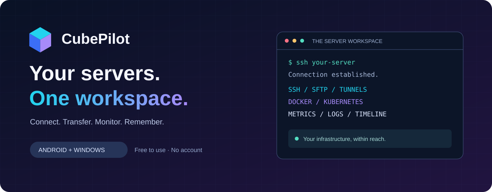
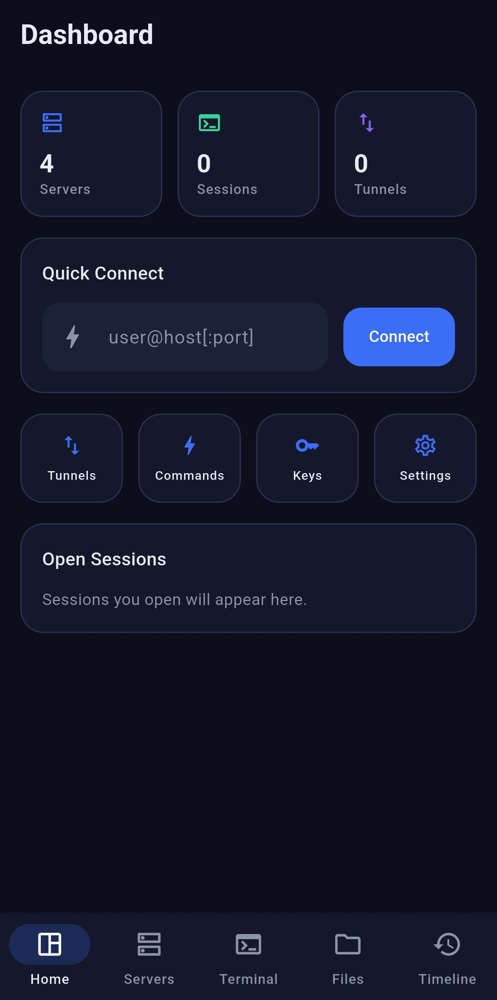
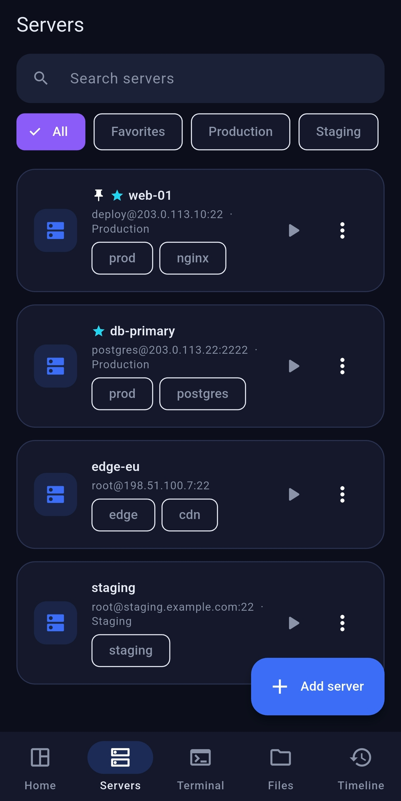
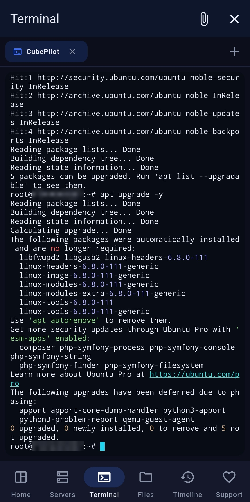
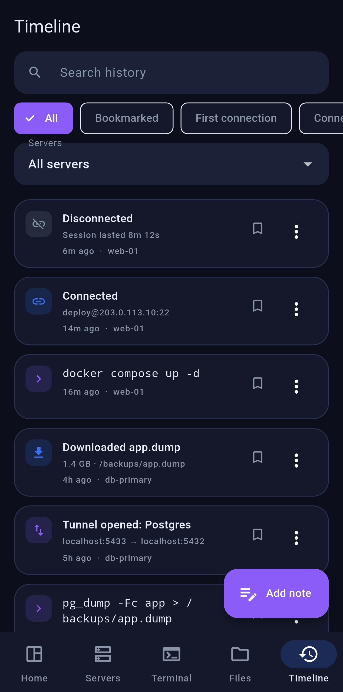
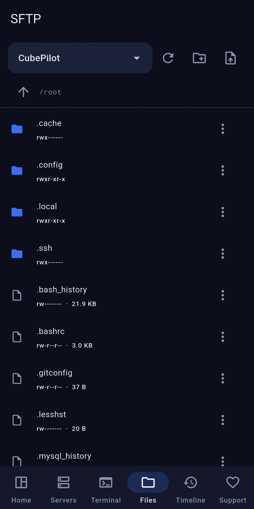
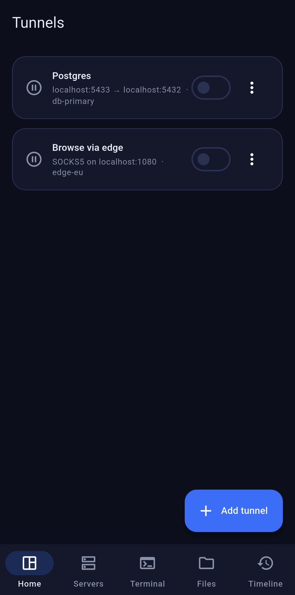
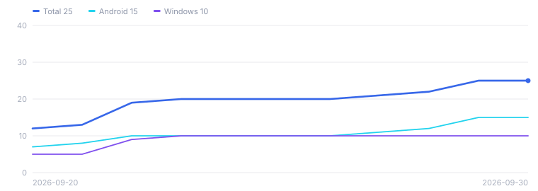

**SSH, files, containers and server health. In your pocket and on your desktop.**

**[Download](#download)** · [Explore features](#your-everyday-server-toolkit) · [Screenshots](#a-look-inside) · **[فارسی](README-fa.md)**

## Download

**[v0.5.0 is available](https://github.com/cubepy/CubePilot/releases/tag/v0.5.0)** — resumable transfers, tmux shells, custom terminal keys, Windows tray, update notices and health comparisons.

| Android | Windows |
| :--- | :--- |
| **[Download APK · ARM64](https://github.com/cubepy/CubePilot/releases/download/v0.5.0/CubePilot_v0.5.0_arm64_v8a.apk)** | **[Download portable ZIP · x64](https://github.com/cubepy/CubePilot/releases/download/v0.5.0/CubePilot_v0.5.0_windows_x64.zip)** |
| For most current phones | Extract and run `cubepilot.exe` |
| [32-bit ARM](https://github.com/cubepy/CubePilot/releases/download/v0.5.0/CubePilot_v0.5.0_armeabi_v7a.apk) · [x86_64](https://github.com/cubepy/CubePilot/releases/download/v0.5.0/CubePilot_v0.5.0_x86_64.apk) | Windows 10 1809 or newer, 64-bit |

Android 8.0+ · [Installation guide](docs/installation.md) · [Release notes & SHA-256 checksums](https://github.com/cubepy/CubePilot/releases/tag/v0.5.0) · [All releases](https://github.com/cubepy/CubePilot/releases)

## Your everyday server toolkit

CubePilot brings the work around an SSH session into one place: connect to a host, move files, inspect a container, follow logs and review server activity. Free for personal and commercial use, with no subscription or account required.

| Connect & work | Inspect & manage | Keep your context |
| :--- | :--- | :--- |
| Multi-session SSH and split terminals | Docker containers, logs and shell | Per-server activity timeline |
| SSH keys, jump hosts and proxies | Kubernetes workloads and operations | Notes, search and bookmarks |
| SFTP browsing and file transfers | CPU, memory, disk and network charts | Saved commands and snippets |
| Local, remote and SOCKS5 tunnels | Live logs and server health checks | Folders, tags and smart groups |

### Pick up where you left off

- **Transfers you can control.** Pause, resume or cancel SFTP uploads and downloads. After a connection failure, reconnect and resume the retained transfer. The queue lasts for the current app launch.
- **Remote shells that stay alive.** Enable tmux on a saved server to reattach after a disconnect or app restart. Requires tmux on the server; otherwise CubePilot opens a regular shell.
- **Changes you can see.** Health checks compare the latest result with the previous run, with the snapshot saved across restarts.

### Built for both screens

| Android | Windows |
| :--- | :--- |
| Customizable terminal key row | Native system tray controls |
| Session notification and Quick Settings access | `Ctrl+Alt+T` brings the terminal forward |
| Picture-in-picture terminal | Portable ZIP distribution |
| English and Persian with RTL support | English and Persian with RTL support |

Both platforms include release notices and manual update checks. Choose your terminal keys, order and row height in Settings.

## A look inside

<table>
<tr><td width="33%"> Dashboard</td><td width="33%"> Servers</td><td width="33%"> Terminal</td></tr>
<tr><td width="33%"> Timeline</td><td width="33%"> SFTP files</td><td width="33%"> Tunnels</td></tr>
</table>

Existing app screenshots; appearance may differ in v0.5.0. Demo data and redacted sessions: [how these were captured](docs/screenshots.md).

## Your servers have a history

The **Server Timeline** keeps activity alongside the server it belongs to. Review sessions and recorded actions, add notes, search events and return to the context of your last visit. Pair that history with live monitoring and health comparisons when investigating a problem.

## Local data. Encrypted vault.

Server credentials and settings are held in an **AES-256-GCM encrypted local vault**, with the master key protected by platform secure storage. Host-key verification, PIN lock, supported biometric unlock and encrypted backup export help protect your workspace.

Docker and Kubernetes operations use your SSH connection and the tools and permissions available on the remote server. Updates check GitHub for releases; installation stays under your control.

CubePilot is **freeware and closed source**. This public repository hosts documentation, screenshots and downloadable builds. [License](LICENSE) · [Security reporting](SECURITY.md) · [FAQ](docs/faq.md)

## Start in three steps

1. Download the build for your device and follow the [installation guide](docs/installation.md).
2. Add a server with its hostname, username and SSH key or password. Verify its host-key fingerprint.
3. Open a terminal, browse files or inspect the server from its workspace.

## Help shape CubePilot

[Report a bug](https://github.com/cubepy/CubePilot/issues/new/choose) · [Request a feature](https://github.com/cubepy/CubePilot/issues/new/choose) · [Join discussions](https://github.com/cubepy/CubePilot/discussions) · [Troubleshooting](docs/troubleshooting.md)

Include your app version, platform and steps to reproduce. Replace credentials and private infrastructure details with placeholders. Report security issues using [SECURITY.md](SECURITY.md).

[Changelog](CHANGELOG.md) · [Roadmap](docs/roadmap.md) · [Download statistics](docs/downloads.md)

<b>Download history</b>

Recorded daily since 20 September 2026. [How this is counted](docs/downloads.md).

## ❤️ Support the project

CubePilot is free, and it stays free — every feature, on both platforms, with no pro tier and no ads. That promise doesn't change.

If it saves you time and you'd like to chip in toward hosting, signing certificates and testing devices, a crypto donation is very welcome — and entirely optional.

**Inside Iran:** [donate in rial via Donofa](https://donofa.com/Cube/) — card-to-card, no crypto wallet needed.

Free ways to help are worth just as much: ⭐ star the repository, file a good bug report, or tell someone who is still juggling four terminal windows.

---

**CubePilot** · Part of the Cube ecosystem · [cubesystem.top](https://cubesystem.top)

