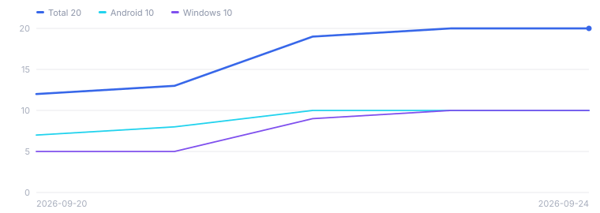

# Downloads

Updated once a day. The raw numbers are in
[`downloads.csv`](downloads.csv) — one row per day, which is the whole
dataset, not a summary of one.

## Where this comes from

GitHub counts downloads but keeps no history. Its API says how many times an
asset has been fetched *so far* and nothing about when, there is no export,
and nothing can be backfilled. So this chart does not begin when CubePilot
did — it begins on the day someone started writing the numbers down, which
was 20 September 2026. Everything before that is gone and cannot be
recovered.

## Two things that look like bugs and are not

**The total can go down.** A download count belongs to an asset, not to a
release. Replacing a release's files — which happened to v0.2.1, whose
binaries were rebuilt after the home-screen widget was removed — takes their
counts with them. The file records what GitHub said on the day. It is a log,
not a ledger.

**Source archives are not counted.** The "Source code (zip)" links GitHub
generates on every release have no counter at all. What is plotted here is
downloads of the binaries that were actually published, which is the number
worth having.

## What is counted where

`android` is every `.apk`, across all three ABIs. `windows` is the desktop
zip. `total` is both, plus anything published before the current naming — it
is the sum of every asset on every release, so it stays correct no matter
what future releases are called.
